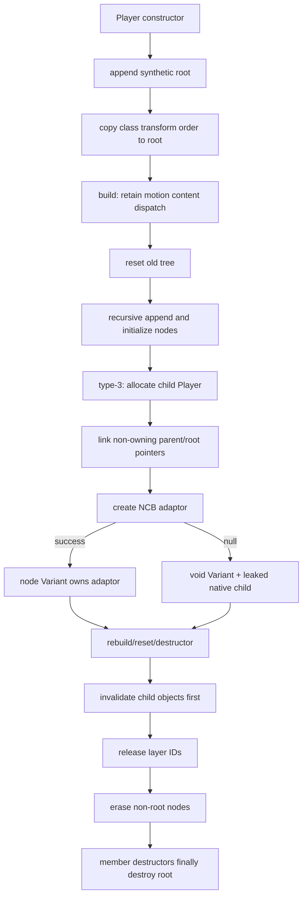

# MotionPlayer 节点树构建与子 Player 生命周期四端对照（2026-08-12）

## 结论

本轮以 `reference/binaries/` 中 Android arm64、Android armv7、iOS arm64、iOS armv7 四个当前参考二进制为共同真值，重新复原了 `Player` 的节点树构建、节点字段初始化、type-3 子 `Player` 创建、type-4 粒子数组遍历、旧树重置和析构路径。旧的 `libkrkr2.so` 单端注释不再作为证据。

四端在控制流和边界行为上相同，主要差异来自：

- Android 使用 libstdc++ deque；64 位每块一个节点，32 位同样每块一个节点。
- iOS 使用 libc++ deque；64 位和 32 位均每块 16 个节点。
- `MotionNode`、`Player` 和 STL 容器对象的 ABI 尺寸不同。
- 编译器生成的临时对象、异常清理 landing pad、NCB adaptor 桥接形式略有不同。

已据此修复本地实现中以下错误假设：非对象 layer 静默跳过、错误的节点默认值、根节点父索引、重复 type-9 anchor 字段、type-4 错误按真实下标遍历、旧树释放顺序、type-3 adaptor 失败后的错误清理，以及重建前未先保留 motion content dispatch 等。

## 函数映射

| 语义 | Android arm64 | Android armv7 | iOS arm64 | iOS armv7 |
|---|---:|---:|---:|---:|
| `Player_initNodeFields_guess` | `0x6B1058` (`0xC8C`) | `0x580FA4` (`0x58A`) | `0x100108720` (`0x778`) | `0x105E70` (`0x820`) |
| `Player_buildNodeTree_guess` | `0x6B25D0` (`0x508`) | `0x581CC8` (`0x1D0`) | `0x1001097C8` (`0x24C`) | `0x107060` (`0x20E`) |
| `Player_buildNodeTreeRecursive_guess` | `0x6B1E4C` | `0x5818B0` | `0x100109328` | `0x106BDC` |
| `Player_resetAndReleaseOldNodeTree_guess` | `0x6B2AD8` | `0x581F3C` | `0x100109ACC` | `0x107358` |
| `Player_visitOwnedPlayerVariants_guess` | `0x6CB2F4` | `0x592D80` | `0x10011DB98` | `0x11C46C` |
| `InvalidateOwnedPlayerVariantCallback_invoke_guess` | `0x6F113C` | `0x5AE74E` | `0x100144004` | `0x144C58` |
| `Player` 构造 | `0x6CC110` | `0x5935C4` | `0x10011EC04` | `0x11D488` |
| `Player` 析构 | `0x6CCEBC` | `0x593C24` | `0x10011F2A0` | `0x11DCC4` |
| transform-order 数字读取/默认值 | `0x660B9C` | `0x4C7834` | `0x100100DF8` | `0xFDF84` |
| node deque append 入口 | `0x6EED94` | `0x581C28` | `0x10010973C` | `0x106FF4` |
| `MotionNode_ctor_guess` | `0x6EED94` | `0x5ACC70` | `0x10014151C` | `0x1425BC` |
| `MotionNode_initCommonFields_guess` | `0x696770` | `0x572A2C` | `0x1000F6580` | `0xF316C` |
| 非根节点后缀 erase | `0x6F11EC` | `0x592F18` | `0x10011DDB8` | `0x11C6B4` |

Android arm64 的 deque append 另有慢路径 `0x6EECF4`；V232 进一步确认
`0x6EED94` 同时包含该端被内联到 append 路径的真实节点构造体，而
`0x696770` 只负责 common-field 初始化。其余三端表中的 append 入口最终调用
表中的真实节点构造函数。

## 主构建入口

四端共同伪代码如下。2026-08-16 的四端模板复核进一步确认这里的 owner 是
`ncbPropAccessor`，不是只保存 raw dispatch 的 plugin-local helper。`CopyRef`、`AsObject`、
accessor vptr 与清理顺序都是语义的一部分：

```text
Player_buildNodeTree(player):
    motionContentCopy = copy(player.motionContentVariant)
    motionContent = ncbPropAccessor(motionContentCopy)      // retained
    clear(motionContentCopy)

    player.resetAndReleaseOldNodeTree()

    layers = motionContent.GetValue<tTJSVariant>("layer", hint = null)
    buildRecursive(player, parentIndex = 0, layers)

    for nodeIndex in [1, nodeCount):
        node = nodes[nodeIndex]
        if node.type != 12 or (node.stencilType & 4) == 0:
            continue
        masks = ncbPropAccessor(node.stencilCompositeMaskLayerListVariant)
        count = masks.GetArrayCount()                       // PropGet("count")
        for i in [0, count):
            rawLabel = masks.GetValue<ttstr>(i)
            targetIndex = rawLabelMap.find(rawLabel)        // nonrecursive
            if not found:
                continue
            target = nodes[targetIndex]
            if target.type == 0 or target.type == 3:
                node.stencilCompositeMaskNodes.push_back(&target)
                target.stencilCompositeMaskReferenced = true

    destroy(motionContent)
```

重要失败边界：

- 没有 `_motionContentVariant.Type() == tvtObject` 的前置判断。
- `AsObject()` 在旧树重置之前执行。因此 motion content 不是对象时会先抛异常，旧树保持不变。
- `layer` 用 `hint = nullptr` 读取；不是 process-wide persistent hint。
- type-12 后处理使用原始 label map，不递归解释路径。

## 递归 walker 的准确顺序

每次递归调用都以 `ncbPropAccessor` 独立保留 `layers` 数组；ResourceManager 则走不同的
raw retained-dispatch owner 路径：

```text
buildRecursive(player, parentIndex, layersVariant):
    layersCopy = copy(layersVariant)
    layers = ncbPropAccessor(layersCopy)                   // retained
    clear(layersCopy)
    count = layers.GetArrayCount()                         // PropGet("count")

    resourceManagerCopy = copy(player.resourceManager)
    resourceManagerDispatch = resourceManagerCopy.AsObject() // retained
    clear(resourceManagerCopy)

    persistentRequireHint = processWideHint

    for i in [0, count):
        thisIndex = nodes.size()
        node = deque.emplace_back()                         // full ctor first
        node.slots[0].done = true
        node.slots[1].done = true
        node.parentIndex = parentIndex

        layer = layers.GetValue<tTJSVariant>(i)             // may throw
        layerCopy = copy(layer)
        layerAccessor = ncbPropAccessor(layerCopy)          // retained; may throw
        clear(layerCopy)

        rawLabel = layerAccessor.GetValue<ttstr>("label", hint = null)
        rawLabelMap[rawLabel] = thisIndex

        node.layerId1 = resourceManager.requireLayerId(layer, &persistentRequireHint)
        node.layerId2 = resourceManager.requireLayerId(layer, &persistentRequireHint)

        initNodeFields(player, node, layer, thisIndex)       // constructs a second accessor

        children = layerAccessor.GetValue<tTJSVariant>("children", hint = null)
        buildRecursive(player, thisIndex, children)
```

由此得到几项容易被“安全化”破坏的行为：

1. 节点在数组取值、对象转换和任何属性读取之前已经 append。异常会保留一个部分初始化节点。
2. 非对象 layer 不会被跳过；对象转换直接失败。
3. raw-label map 的 label 与 `node.layerName` 来自两次独立属性读取。若 getter 有副作用，两者可以不同。
4. `requireLayerId` 连续调用两次，并共享同一个持久 hint；不能合并成一次。
5. 即使 `count == 0`，本次递归仍会在计数读取后获取并保留 ResourceManager dispatch。

## `MotionNode` 构造默认值与根节点

四端普通 `MotionNode` 构造一致：

- `parentIndex = 0`。
- `inheritFlags = 0`。
- `transformOrder = {0, 0, 0, 0}`。
- 两个 clip slot 的 `done` 字节均为 true。

`Player` 构造只 append 一个合成根节点，然后把类级 `s_defaultTransformOrder` 复制到根节点。当前 native 默认为 `{0, 3, 2, 1}`。因此普通节点构造默认值与根节点默认值不是一回事。根节点的 `parentIndex` 仍为 0，不是 -1。

## 节点属性读取顺序

`Player_initNodeFields_guess` 的共同读取顺序为：

1. `emoteEdit`：先以 `TJS_MEMBERMUSTEXIST` 和持久 hint 探测；存在时再用同一 hint 读取到节点 Variant，否则显式置 void。
2. `label`：持久 hint；这是第二次读取 label。
3. `parameterize`：持久 hint。
4. `coordinate`：持久 hint。
5. `joinTarget`：持久 hint。
6. `groundCorrection`：持久 hint。
7. `frameList`：持久 hint。
8. `inheritMask`：持久 hint。
9. `transformOrder`：持久 hint；转成 accessor 后对索引 0..3 调
   `getIntValue(index, 0)`。每个存在项是 `MEMBERMUSTEXIST` 探测加第二次普通读取，采用第二
   值且忽略第二次 HRESULT；缺项只探测一次并返回 0。
10. `meshTransform`，以及条件 mesh 字段；`meshCombine` 同样先存在性探测再第二次读取。
11. `type`。
12. `stencilType`：存在性探测后第二次读取，不存在则 0。
13. type-specific 属性；这部分多数使用空 hint。

不存在 holder `Type()` 防御。局部实现若先判断 Variant 类型再返回，会改变 native 异常边界。

持久 hint 地址如下，仅用于 ABI/反编译复核：

| hint | Android arm64 | Android armv7 | iOS arm64 | iOS armv7 |
|---|---:|---:|---:|---:|
| init 属性族（连续 9 项） | `0x1AB53F4..0x1AB5414` | `0x1111890..0x11118B0` | `0x101B698BC..0x101B698DC` | `0x187D560..0x187D580` |
| `requireLayerId` | `0x1AB5418` | `0x11118B4` | `0x101B698E0` | `0x187D584` |
| `releaseLayerId` | `0x1AB549C` | `0x1111938` | `0x101B69964` | `0x187D608` |

Android arm64 的这些值位于合并静态块 `0x1AB50B0` 内；该 IDB 中不应把内部元素伪装成独立全局对象。

## type-3 子 `Player`

type-3 初始化共同数据流：

```text
node.stencilType &= ~4
node.meshType = 0
child = new Player(parentResourceManagerVariant)

child.parentPlayer = player                         // non-owning
child.rootPlayer = player.rootPlayer ? player.rootPlayer : player

if layer has "motionIndependentLayerInherit":
    value = second read of same property
else:
    value = false

if child.motionIndependentLayerInherit != value:
    child.nodes[0].dirty = true
    child.motionIndependentLayerInherit = value

child.type3RootTransformAlreadyPropagated = true
child.findMotionContext = player.findMotionContext
copy node.coordinateMode to child root
child.setZFactor(player.zFactor)
copy node.transformOrder to child root

adaptor = NCB.CreateAdaptor(child)
if adaptor != null:
    assign exact object closure into node.childPlayerVar
    balance temporary references
else:
    leave node.childPlayerVar void
    do not delete child
```

`type3RootTransformAlreadyPropagated` 不是一个泛化的“子 Player 已初始化”状态，
而是只有三类访问的单向 root-matrix marker：

| 目标 | Player 字段 | ctor 清零 | type-3 producer 写 true | updateLayers consumer | 条件调用 |
|---|---:|---:|---:|---:|---:|
| Android arm64 | `+908` | `0x6CC4F4` | `0x6B1A00` | `0x6B88D0` | `0x6B88E8` → `0x696D20` |
| Android armv7 | `+628` | `0x593834` | `0x58130C` | `0x585862` | `0x585872` → `0x572F80` |
| iOS arm64 | `+796` | `0x10011EE90` | `0x100108C00` | `0x10010E730` | `0x10010E744` → `0x1000F6A7C` |
| iOS armv7 | `+564` | `0x11D8A4` | `0x1063C2` | `0x10C02C` | `0x10C03A` → `0xF36BC` |

四端的 producer 都在 type-3 child 的 independent-layer-inherit 处理之后直接写
`1`，然后才 copy find-motion context、coordinate mode、zFactor 和 transform order。
`Player_updateLayers_guess` 在复制 root delta block 并插值 variable tracks 后读该 byte：
为零时调用各端已命名的 `MotionNode_rebuildLocalMatrix_guess`，非零时跳过。
它没有 per-frame clear、公开 setter 或析构写入。因此 type-3 child 一直保留父 motion
预先传递的 root 2x2；type-4 particle child 没有 producer 写入，正常在自身
updateLayers 中重建 root matrix。

adaptor 创建失败时，native child 被故意泄漏；它既不删除 native `Player`，也不把 node Variant 设为一个占位对象。之后旧树 reset visitor 会把 void Variant 当对象转换并抛异常。这个失败面在四端一致，不能用空值判断抹平。

四端 `Player` 分配大小：

| ABI | bytes |
|---|---:|
| Android arm64 | 1384 (`0x568`) |
| Android armv7 | 944 (`0x3B0`) |
| iOS arm64 | 1208 (`0x4B8`) |
| iOS armv7 | 840 (`0x348`) |

## type-4 初始化和旧树遍历缺陷

type-4 初始化先显式写入：prior matrix 为 identity、prior angle/timer 为 0、particle emitter flag 为 false，然后才读取属性并创建 TJS Array。

旧树 visitor 的 type-4 循环虽然读取 `count` 并递增循环计数器，却在每一轮固定调用 `PropGetByNum(0)`：

```text
count = particleArray.count
for loopCounter in [0, count):
    child = particleArray[0]       // 固定 0，不是 loopCounter
    if callback(child) == false:
        return false               // 停止整个 node visitor
```

原始指令复核：

- Android arm64：索引寄存器由 `MOV W1, WZR` 固定为 0，循环计数使用 `W23`。
- Android armv7：调用前 `MOVS R0, #0` 作为索引，循环计数使用 `R10`。
- iOS arm64：`MOV W1, #0`，循环计数使用 `W23`。
- iOS armv7：`MOVS R1, #0`，另有独立循环计数器。

因此含两个粒子的数组会让第 0 个粒子收到两次 `Invalidate(0, nullptr, nullptr, self)`，第 1 个粒子一次也收不到。这是四端一致的可观察边界行为，已加入回归测试。

## type-9 物理字段

四端只有一个物理整数保存原始 `anchor` 属性，供 type-9 camera-constraint pass 使用。本地先前拆出的 `anchorType` 与 `cameraConstraintType` 是同一字段被重复建模；现只保留精确名称未知的 `anchorType_guess`。

## 旧树重置与资源释放

> 2026-08-16 V163 follow-up：本节控制流/容器结论经四端 fresh decompile 再确认；
> `releaseLayerId` 已闭合为 `parameter` 后的精确进程级槽，随后紧邻 `window` 与
> `piledCopy`。源码已删除 reset-local 重复 hint，并加入普通 failure、0/负 ID 与 re-entrant
> owner-clear 探针。完整地址和验证见
> `analysis/motionplayer_old_node_reset_release_window_piled_hint_sequence_four_binary_2026-08-16.md`。

四端共同顺序如下：

```text
resetAndReleaseOldNodeTree(player):
    resourceManagerCopy = copy(player.resourceManager)
    resourceManager = resourceManagerCopy.AsObject()        // retained first
    clear(resourceManagerCopy)

    visit every node including synthetic root in deque order:
        type 3: callback(node.childPlayerVar)
        type 4: callback(array[0]) repeated array.count times
        callback(v):
            object = v.AsObjectNoAddRef()
            object.Invalidate(0, null, null, object)
            return true

    for each entry in evalCascadeMap:
        entry.writeVal = 1.0
        entry.heapResult.clear()                             // retain capacity
        // entry.weight is untouched

    persistentReleaseHint = exact processWide releaseLayerId hint
    for each non-root node:
        resourceManager.releaseLayerId(node.layerId1, &hint)
        resourceManager.releaseLayerId(node.layerId2, &hint)
        if node.preparedRenderItem != null and item.active:
            resourceManager.releaseLayerId(item.renderLayerId, &hint)

    erase nodes[1..end)
    rawLabelMap.clear()
```

关键点：

- ResourceManager 在任何 child callback 之前转换并保留。
- visitor 包含根节点。
- callback 忽略 `Invalidate` 返回码，固定继续。
- HM1 cascade 的 `weight` 不改；`heapResult.clear()` 不释放 vector capacity。
- 三种 layer id 都通过同一 retained ResourceManager 和同一 release hint 释放。
- 非根节点 erase 在所有释放后执行；根节点保留到 `Player` 自身 deque 析构。

`Player` 析构的高层顺序是：清 ramp map、清 parameter entries、调用同一个旧树 reset、删除 `SeparateLayerAdaptor`，随后进入成员逆序析构。重建与 child reset 都复用同一 reset 实现。

## 容器 ABI

| ABI | `MotionNode` stride | Player 中 deque 偏移 | deque 对象大小 | 每 block 元素数 |
|---|---:|---:|---:|---:|
| Android arm64 / libstdc++ | 2632 | 184 | 80 | 1 |
| Android armv7 / libstdc++ | 2272 | 152 | 40 | 1 |
| iOS arm64 / libc++ | 2648 | 160 | 48 | 16 |
| iOS armv7 / libc++ | 2228 | 136 | 24 | 16 |

这些差异解释了 append、迭代与 suffix erase 的反编译形态差异；不能据其中一个 ABI 的指针步长为跨平台 C++ 结构硬编码 padding。

## 生命周期与引用计数摘要



保留 motion-content accessor 的时机防止旧树 teardown 或脚本回调间接改变
`_motionContentVariant` 后导致悬空。每次 recursive invocation 独立保留 RM，则保证脚本
getter、require 调用或子构建期间 `Player` 字段发生变化时，本层仍使用进入时的对象。

2026-08-16 的 accessor 源码身份、helper 映射与 transform 双读回归详见
`analysis/motionplayer_node_tree_ncb_accessor_source_identity_four_binary_2026-08-16.md`。

## 本地实现对应

- `cpp/plugins/motionplayer/NodeTree.cpp`：主/递归构建、属性顺序、type-specific 初始化、type-12 postpass。
- `cpp/plugins/motionplayer/PlayerMotionLoad.cpp`：旧树 visitor 调用、HM1 重置、layer ID 释放、type-3 child 链接与构建入口。
- `cpp/plugins/motionplayer/RuntimeSupport.cpp`：根节点创建、type-3/type-4 Variant visitor、非根 deque 后缀删除。
- `cpp/plugins/motionplayer/MotionNode.h`：节点逻辑字段和构造默认值。
- `tests/unit-tests/plugins/motionplayer-dll.cpp`：节点默认值、type-4 固定索引 0，以及
  transform `getIntValue` 双读/status/default 边界的回归覆盖。

## 验证状态

- Web debug `motionplayer` 静态库及完整 `index.html` 目标已编译/链接通过；立即复跑为 `no work to do`。
- Wasmtime headless debug `motionplayer` 静态库及完整 `krkr2_wasmtime_guest`（含 exnref 转换）已编译/链接通过；立即复跑为 `no work to do`。
- `tests/unit-tests/plugins/motionplayer-dll.cpp` 已用当前 Web/Emscripten 头文件和编译定义完成独立语法编译，仅有项目既有 `_tss` deprecated warning。
- 原生 `ENABLE_TESTS` 配置仍受既有 vcpkg `cocos2dx:x64-windows` 依赖构建失败阻断，因此本轮无法链接并执行 Catch2 测试；Web 和 Wasmtime 配置按项目约定关闭 unit tests。
